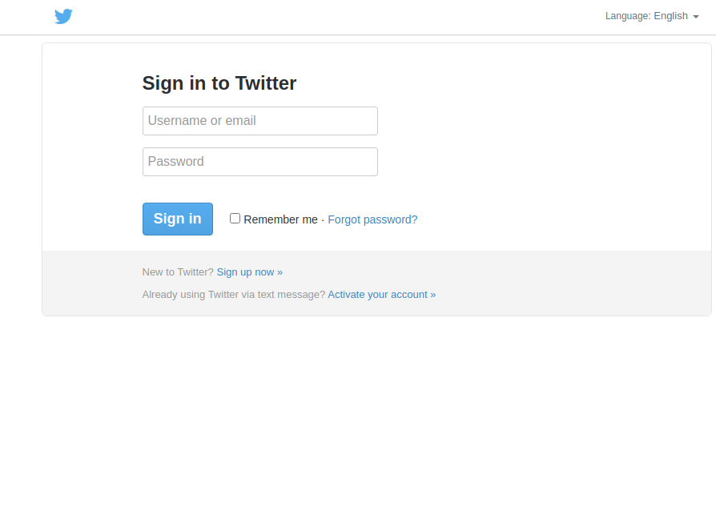

## Ferramentas
- Kali Linux
- setoolkit

## Configurando o Phishing no Kali Linux
- Antes de tudo mudar a configuração de rede da VM para Bridge adapter para ter acesso a internet.
- Entrar como root no terminal `sudo su`
- Iniciar o setoolkit: `setoolkit`
- Selecionar o tipo de ataque: `Social-Engineering Attacks`
- Selecionar vetor de ataque: `Web Site Attack Vectors`
- Selecionar método de ataque: `Credential Harverster Atack Method`
- Selecionar outro método de ataque: `Web templates`
- Obter o endereço da máquina: `ifconfig`, como já estamos no modo bridge, ele já sugere nosso ip, então basta dar enter.
- Selecionei o twitter

### Resultado da Captura
